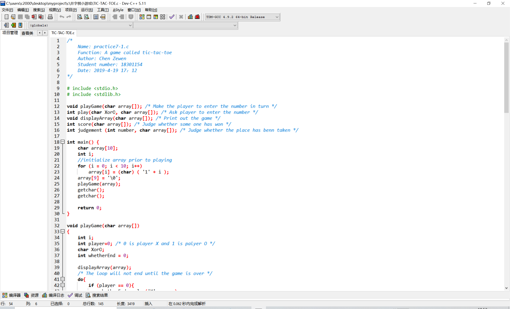
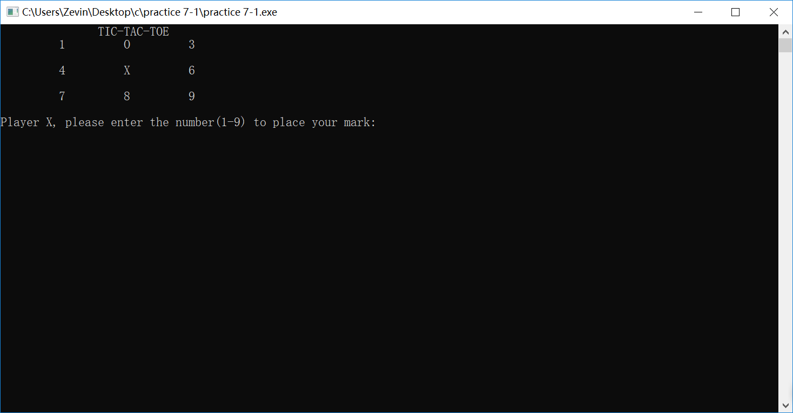
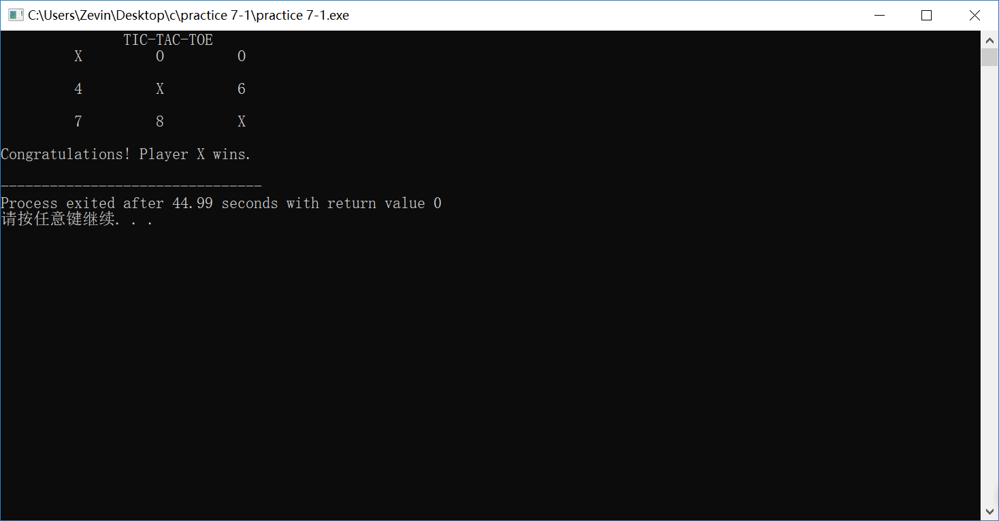
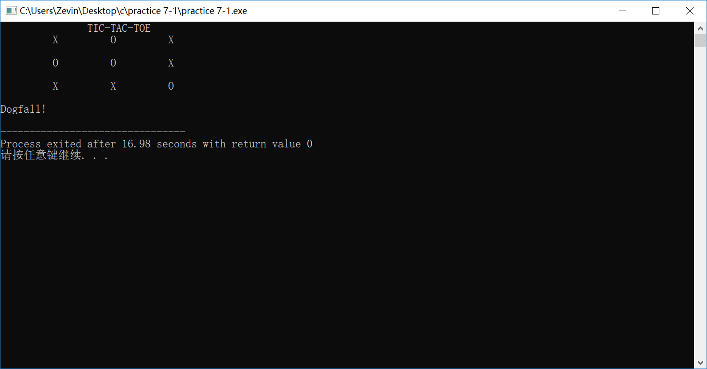

# 井字棋小游戏

## 介绍

大一下学期C语言课程作业

实现井字棋小游戏

### 文件结构

```
----井字棋小游戏\      
    |----image\
    |    |----README\      
    |    |    |----devOpen.jpg
    |    |    |----img1.png
    |    |    |----img2.png
    |    |    |----img3.png
    |    |    |----img4.png
    |    |    |----img5.png
    |    |    |----img6.png
    |----README.md
    |----TIC-TAC-TOE.c
    |----TIC-TAC-TOE.exe
```

### 环境配置

- C99
- Dev-C++ 5.1

## 实现功能

玩家输入井字棋中对应的数字，就可以下对应的棋子

形如：
```
               TIC-TAC-TOE
         1         2         3

         4         5         6

         7         8         9

Player X, please enter the number(1-9) to place your mark: 5

```
输入```5```后，回车

命令行刷新，5处变成棋子x

```
               TIC-TAC-TOE
         1         2         3

         4         X         6

         7         8         9

Player O, please enter the number(1-9) to place your mark:
```

## 运行展示

1. 点击calendar.c用DEV打开项目
   
2. 玩一把
   
   
   
   
   
3. 平局
   

## 版权声明©

该项目所有代码均为[Zevin](https://github.com/chencn2020)原创

如果有问题，欢迎大家提ISSUE

整理不易，如果觉得还不错的话记得给个star哦
