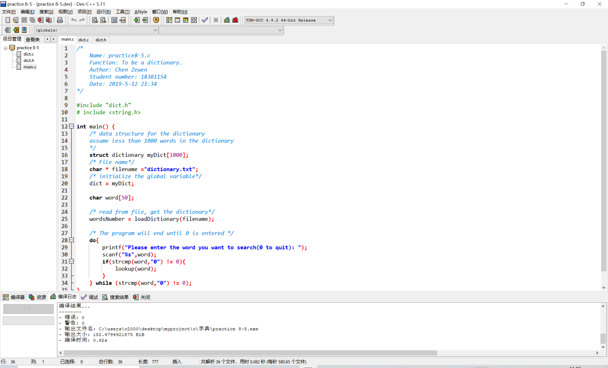
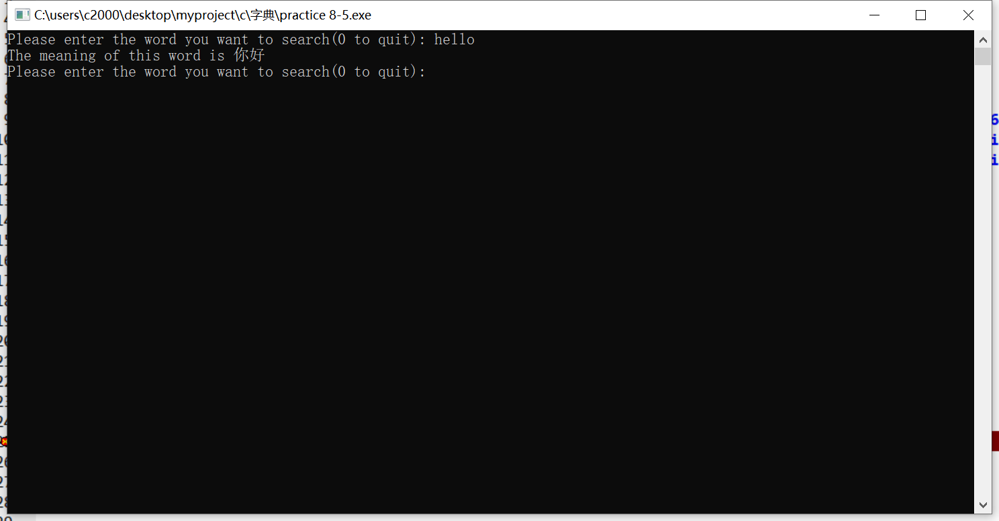
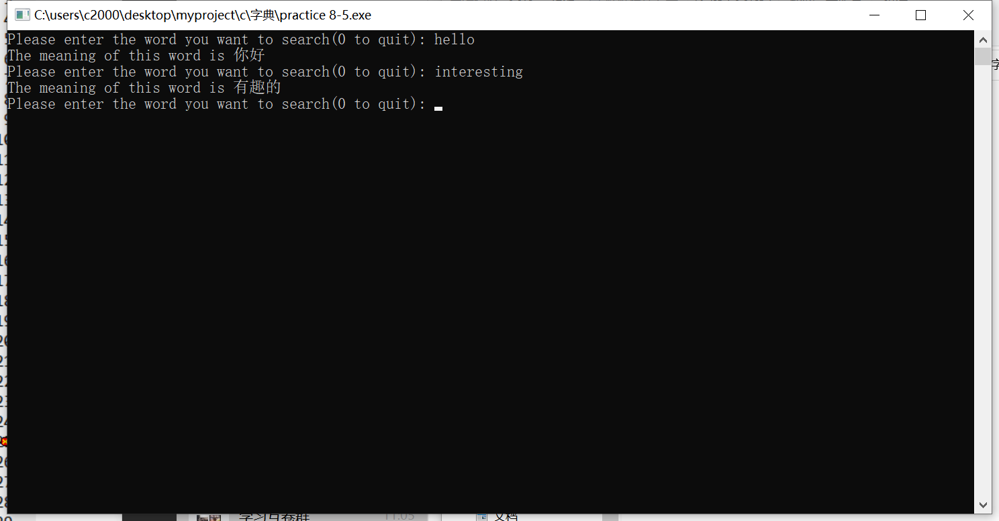

# 字典

## 介绍

大一下学期C语言课程作业

采用模块化编程、结构体和文件读取实现简单的英汉翻译

### 文件结构

```
----字典\
    |----dict.c
    |----dict.h
    |----dictionary.txt
    |----image\
    |    |----README\
    |    |    |----devOpen.jpg
    |    |    |----dictionary.jpg
    |    |    |----hello.jpg
    |    |    |----interesting.jpg
    |----main.c
    |----dictionary.dev
    |----dictionary.exe
    |----README.md
```

### 环境配置

- C99
- Dev-C++ 5.1

## 实现功能

用户从命令行中输入想要查找的英文单词，程序就会自动在相应的[dictionary.txt](/dictionary.txt)文本文件中查找对应的翻译

形如：
```
Please enter the word you want to search(0 to quit): hello
The meaning of this word is 你好
Please enter the word you want to search(0 to quit): what
Can't find the word!

```


## 运行展示

1. 点击calendar.c用DEV打开项目
   
2. 查找单词```hello```
   
3. 查找单词```interesting```
   


## 可拓展的点
1. 可以采用一些文本近似算法实现对错误单词输入的模糊匹配
如：
```
intersting -> interesting
midle -> middle
```
2. 也可以添加一些文本写入功能，实现对字典的扩增
## 版权声明©

该项目所有代码均为[Zevin](https://github.com/chencn2020)原创

如果有问题，欢迎大家提ISSUE

整理不易，如果觉得还不错的话记得给个star⭐哦
