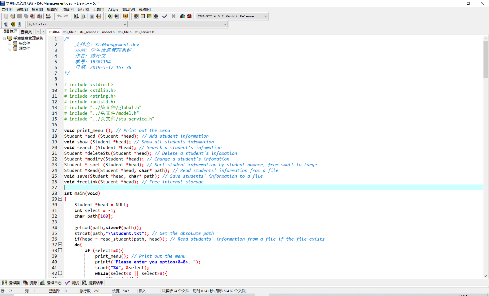
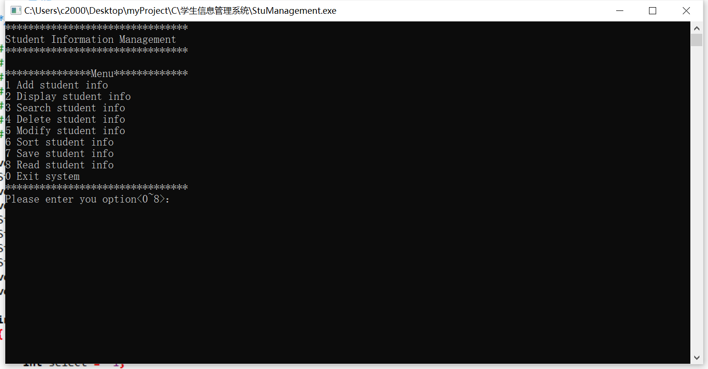
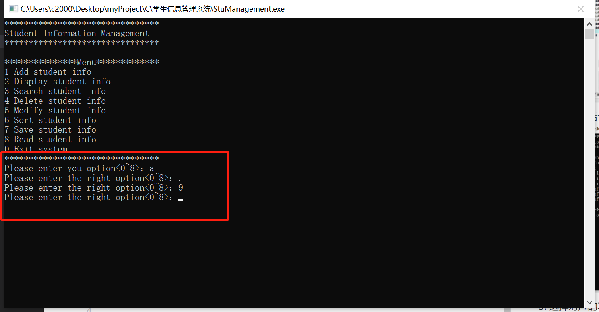
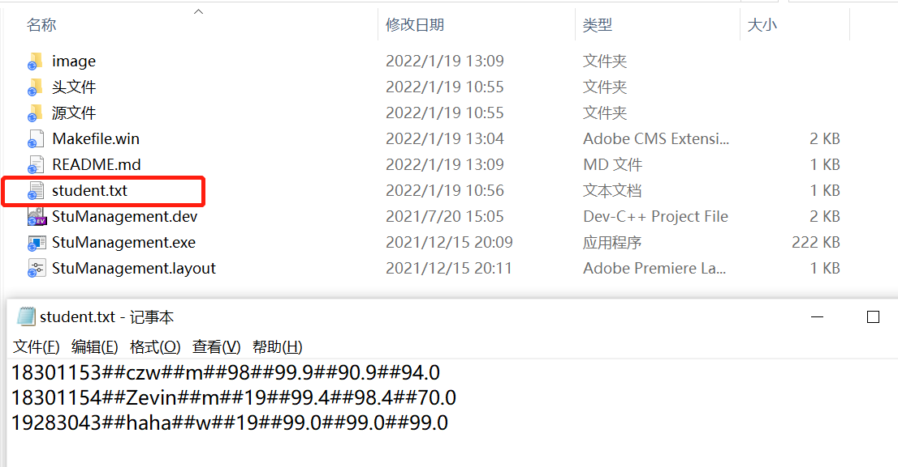

# 学生信息管理系统

## 介绍

大一下学期C语言结课大作业

通过使用面向过程的编程实现对学生信息录入，修改，管理等功能

### 文件结构

----学生信息管理系统\      
    |----getFileTree.py    
    |----image\
    |    |----README\      
    |    |    |----img1.jpg
    |    |    |----img2.jpg
    |    |    |----img3.jpg
    |    |    |----img4.jpg
    |    |    |----video.mp4
    |----README.md
    |----student.txt
    |----StuManagement.dev
    |----StuManagement.exe
    |----头文件\
    |    |----global.h
    |    |----model.h
    |    |----stu_file.h
    |    |----stu_service.h
    |----源文件\
    |    |----main.c
    |    |----stu_file.c
    |    |----stu_service.c

### 环境配置

- C99
- Dev-C++ 5.1

## 实现功能

1. 学生信息录入
2. 学生信息修改
3. 学生信息删除
4. 学生信息查找
5. 学生信息展示
6. 学生信息排序（冒泡）
7. 保存学生信息至txt文件
8. 从txt中读取学生信息
9. 退出系统

## 运行展示

1. 点击StuManagement.dev用DEV打开项目
   
2. 编译运行后命令行
   
3. 选择对应的功能数字即可进入对应的功能，同时也提供简单的容错判断
   
4. 学生信息存可以被程序存放在student.txt文件中，可以进行基本的增删改查
   

## 简单演示

<video src="image/README/video.mp4" width=100% height=100% controls="controls"></video>

## 版权申明©

所有代码均为[Zevin](https://github.com/chencn2020)原创

如果有问题，欢迎大家提ISSUE

整理不易，如果觉得还不错的话记得给个star哦
