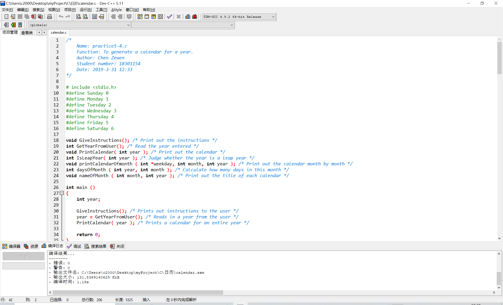
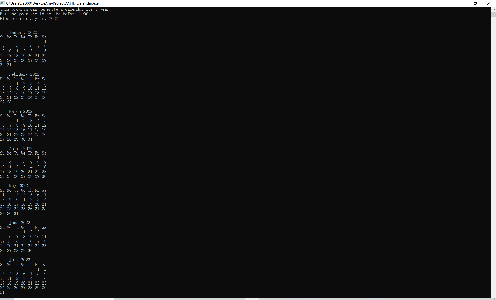
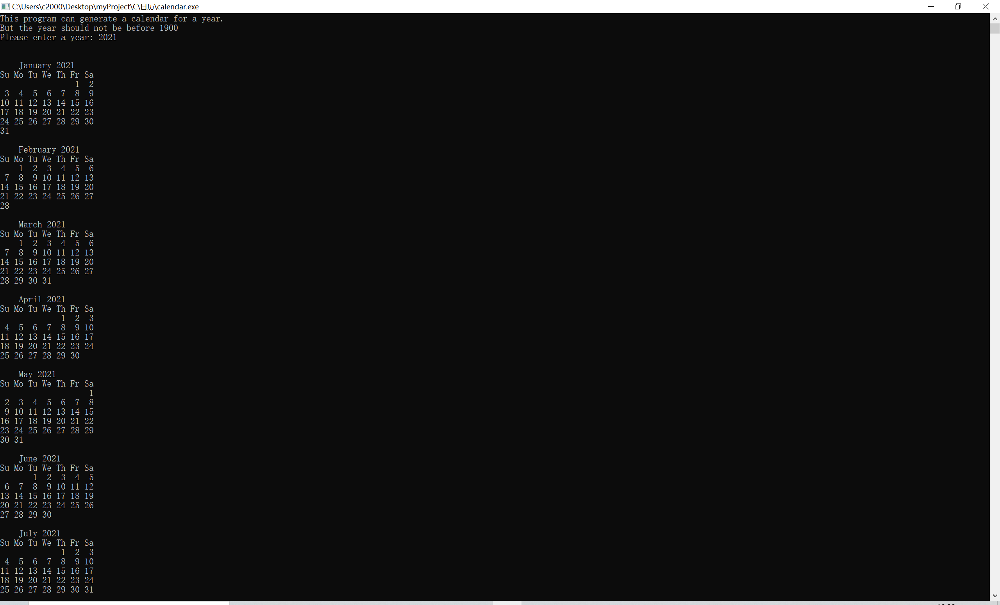
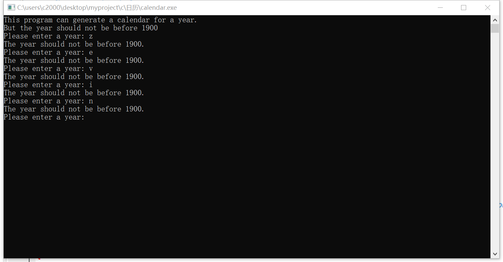

# 日历

## 介绍

大一下学期C语言课程作业

简单的日历实现

### 文件结构

```
----日历\      
    |----image\
    |    |----README\      
    |    |    |----2021.jpg
    |    |    |----2020.jpg
    |    |    |----devOpen.jpg
    |    |    |----errorJudge.jpg
    |----README.md
    |----calendar.c
```

### 环境配置

- C99
- Dev-C++ 5.1

## 实现功能

输入1900年后的任意一个年份，自动生成这一整年的日历

形如：
```
    January 2019
Su Mo Tu We Th Fr Sa
       1  2  3  4  5
 6  7  8  9 10 11 12
13 14 15 16 17 18 19
20 21 22 23 24 25 26
27 28 29 30 31

    February 2019
Su Mo Tu We Th Fr Sa
                1  2
 3  4  5  6  7  8  9
10 11 12 13 14 15 16
17 18 19 20 21 22 23
24 25 26 27 28

    March 2019
Su Mo Tu We Th Fr Sa
                1  2
 3  4  5  6  7  8  9
10 11 12 13 14 15 16
17 18 19 20 21 22 23
24 25 26 27 28 29 30
31

***
```

## 运行展示

1. 点击calendar.c用DEV打开项目
   
2. 输入```2022```
   
3. 输入```2021```
   
4. 提供简单的容错判断
   

## 版权声明©

该项目所有代码均为[Zevin](https://github.com/chencn2020)原创

如果有问题，欢迎大家提ISSUE

整理不易，如果觉得还不错的话记得给个star哦
